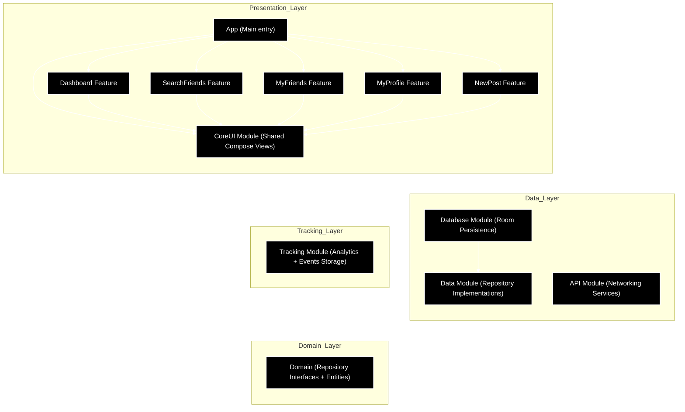
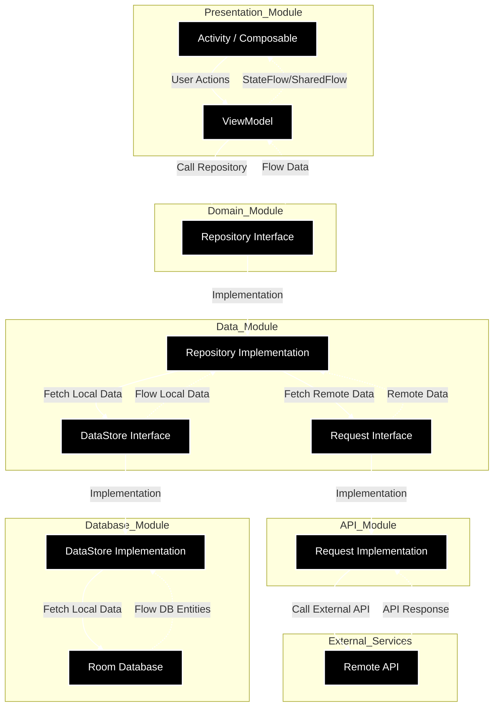

# Pokemaniac – Proof of Concept (POC)

Welcome to the Pokemaniac POC!
This document provides a complete overview of the app’s current state, including technical implementation, business logic, and what’s coming next.

The whole documentation is available in [the Github's Wiki](https://github.com/Fabryo/PokeManiac/wiki).


## How to Run the App

Instructions for installing and launching the app locally are available [here](https://github.com/Fabryo/PokeManiac/wiki/Setup).

## Architecture & Tech Stack

 * Modular architecture following Clean Architecture principles
 * Fully built with Jetpack Compose
 * Key patterns: MVVM, StateFlow, DI with Koin, etc.
 * Libraries: Retrofit, Room, Coil, Coroutines, Flow, Koin, etc.

#### Module Dependency Diagram
   


#### Architecture Data Flow




The Architecture in detail is available [here](https://github.com/Fabryo/PokeManiac/wiki/Architecture-&-Tech-choices#architecture).

More information about the Tech stack is available [here](https://github.com/Fabryo/PokeManiac/wiki/Architecture-&-Tech-choices#tech-choices).

## Concept & Business Plan
 * A social network dedicated to Pokémon card collectors
 * Key features: card library, friend interactions, transaction sharing, and a future marketplace
 * Monetization options: subscriptions, ads, transaction fees

The whole Concept & Business Plan are available [here](https://github.com/Fabryo/PokeManiac/wiki/Concept-and-Business-Plan).

## Business Features Implemented
 * NewsFeed with friend transactions
 * Friend search and subscriptions
 * Profile screen with personal transaction history
 * Transaction posting flow (photo, Pokémon name, price)
 * Local data persistence

More information, screens and videos about the implemented Business Features are available [here](https://github.com/Fabryo/PokeManiac/wiki/Implemented-Business-Features).

## Technical Features Implemented
 * i18n: French 🇫🇷 and English 🇬🇧 supported
 * Dark Mode support
 * Tracking module (mocked, ready to connect to Firebase, Segment…)
 * Unit testing examples across all layers (Request, Repository, UseCase, ViewModel)
 * Jetpack Compose Previews for UI testing

More information about the implemented Tech Features are available [here](https://github.com/Fabryo/PokeManiac/wiki/Tech-Features#implemented-tech-features-).

## Technical Features To Be Added
 * Crash reporting & code quality tools: Crashlytics, Sonar, Lint…
 * Accessibility support
 * Proguard / R8 obfuscation for code security
More information about the backlogged Tech Features are available [here](https://github.com/Fabryo/PokeManiac/wiki/Tech-Features#technical-features-to-add).

## Key Business Features To Be Implemented
 * Full Sign In / Sign Up flow
 * Onboarding journey & subscription paywall
 * Bottom navigation with tabs (Home, Pokédex, Card Search, Marketplace)
 * Marketplace with secure transactions
 * Tablet layout & responsive design
 * AI card recognition and valuation

More information about the backlogged Business Features are available [here](https://github.com/Fabryo/PokeManiac/wiki/Remaining-Features-to-implement)

---

## AI Harness

This project is developed with [Claude Code](https://claude.ai/code) using a structured harness. The harness makes Claude a reliable, consistent co-developer — it knows the architecture, enforces rules automatically, and documents decisions.

**New to this project?** Read `docs/harness/SETUP.md` first — it covers installation, available tools, and how the workflow operates.

---

### How It Works

The harness has five layers:

**1. CLAUDE.md files — always-loaded rules**
Four scoped files loaded automatically into every Claude session:
- `CLAUDE.md` — project-wide: architecture, golden rule, KMP status, available skills, navigation
- `feature/CLAUDE.md` — feature module rules (loaded when working in `feature/`)
- `shared/CLAUDE.md` — KMP shared module rules (loaded when working in `shared/`)
- `iosApp/CLAUDE.md` — iOS rules (loaded when working in `iosApp/`)

**2. `docs/harness/` — reference library (read on demand)**
Detailed documentation Claude reads when the task calls for it:
- `patterns/` — full code patterns with examples: Compose, KMP, iOS, DI, naming
- `checklists/` — step-by-step task guides: new feature, data layer, unit tests, code review, QA handoff
- `adr/` — Architecture Decision Records: why decisions were made, what not to undo
- `WORKFLOW.md` — the development loop, grooming workflow, workshop workflow
- `SETUP.md` — how to configure your environment and what tools are available

**3. `docs/features/` — functional specs**
One markdown file per feature describing what it does for users: flows, screens, business rules, edge cases. Written via the `/write-feature-spec` skill — works solo, in grooming sessions, or during design workshops.

**4. `docs/qa/` — QA handoff documents**
Generated by Claude before each ship. Tells QA what changed, what to test, what the before/after is, and a "don't forget" checklist (airplane mode, small screens, dark mode, accessibility, etc.).

**5. `.claude/settings.json` — automated hooks**
Guards that run on every file edit — no configuration required:

| Guard | What it catches |
|---|---|
| Architecture guard | Feature modules importing from data/api/database layers |
| commonMain purity | Android imports leaking into shared KMP code |
| ktlint | Kotlin style violations (auto-formats, reports remainder) |
| SwiftLint | Swift style violations (auto-fixes, reports remainder) |
| ViewModel memory leak | `Context`/`Activity` references in ViewModels |
| Debug log detector | `Log.*` / `println` left in production code |
| Hardcoded string detector | UI string literals that should use `stringResource` |
| Room migration reminder | Entity/DAO changes that may need a database migration |
| iOS permission check | Permission API usage without `Info.plist` declaration |
| No-commit guard | Claude attempting to commit (all commits are made by the developer) |

---

### Skills Available

**Plugin skills** (require plugin installation — see `docs/harness/SETUP.md`):

| Skill | What it does |
|---|---|
| `/brainstorming` | Design session → spec file. Also runs architecture workshops. |
| `/writing-plans` | Spec → step-by-step implementation plan |
| `/code-review` | Full review of current branch before shipping |
| `swiftui-pro` | Expert SwiftUI guidance |
| `swift-concurrency-pro` | Expert Swift concurrency guidance |

**Project-local skill** (in `.claude/skills/` — no plugin needed):

| Skill | What it does |
|---|---|
| `/write-feature-spec` | Conversational interview → functional spec. Works solo, in grooming, or in workshops. |

---

### Development Workflow (short version)

```
brainstorm → spec → plan → implement → test gate → review → ship
```

Full workflow including grooming and workshop variants: `docs/harness/WORKFLOW.md`

